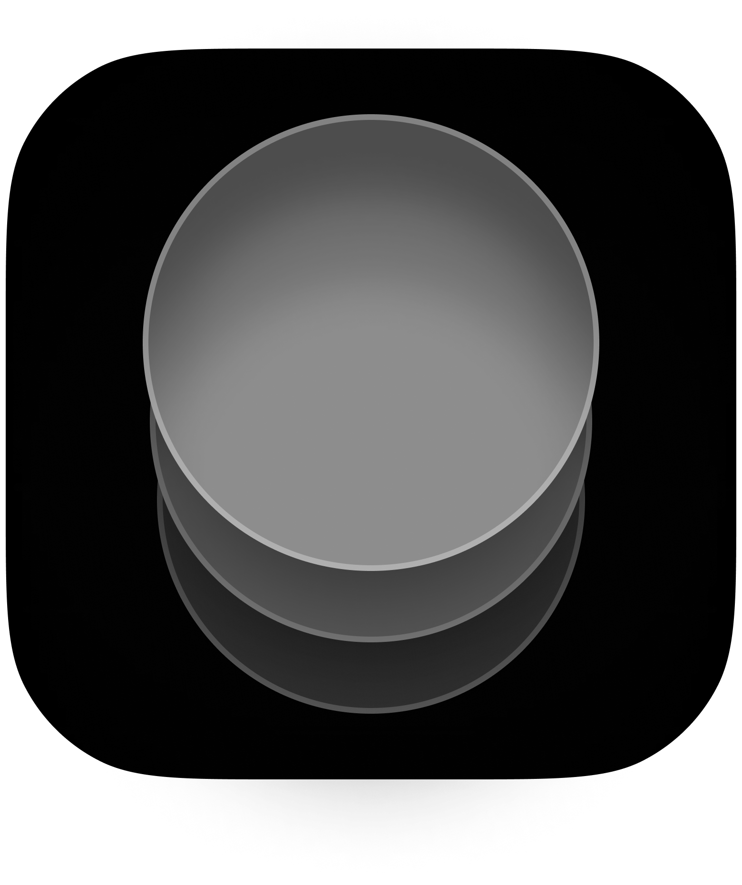

     
    

    <h4>SNS 무료 앱 인기차트 최고 27위 🏆</h4>
    

    <h4>지금 Keyme를 만나보세요</h4>
     
    
    

## 🗝️ Keyme: 나를 찾는 키워드
### T나 F가 아니라 중요한 건, U 🫵
[스크린샷]

다른 사람이 나를 어떻게 생각하는지 궁금했던 적 있나요? **Keyme**와 함께 다른 사람이 보는 나를 알아봐요!

#### 📑 성격 발견하기
다른 곳에선 찾아볼 수 없었던 **Keyme**만의 카테고리로 나만의 특별한 매력을 발견해보세요.

#### 👀 친구들과 함께풀기
성격테스트를 친구들과 공유하고, 당신의 첫인상과 새로운 모습에 대해 알아보세요.

#### 🎨 자랑하기
**Keyme**의 성격 그래프를 SNS에 공유해 당신의 유니크한 성격을 자랑해보세요.

## :computer: Environment
- Xcode 14 ~
- iOS 16 ~
- Swift 5.8 ~

## ⚒️ Tech Spec.
### Management
- ComposableArchitecture(TCA)
- Tuist
- SPM

### UI
- SwiftUI (mainly)
- UIKit (partially)
- Introspect

### Async programming
- Swift Concurrency

### Networking
- Moya
- Alamofire

### ETC
- SwiftLint
- Lottie
- Kingfisher
